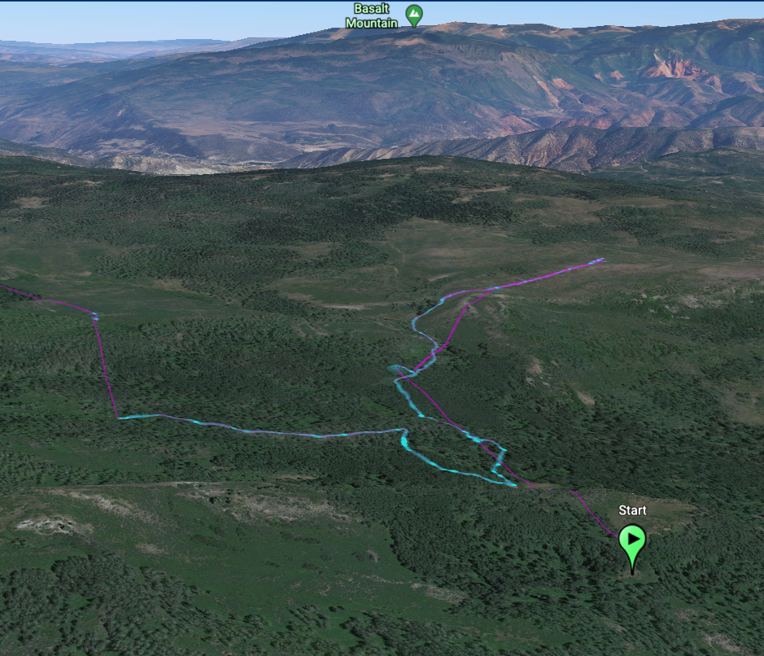
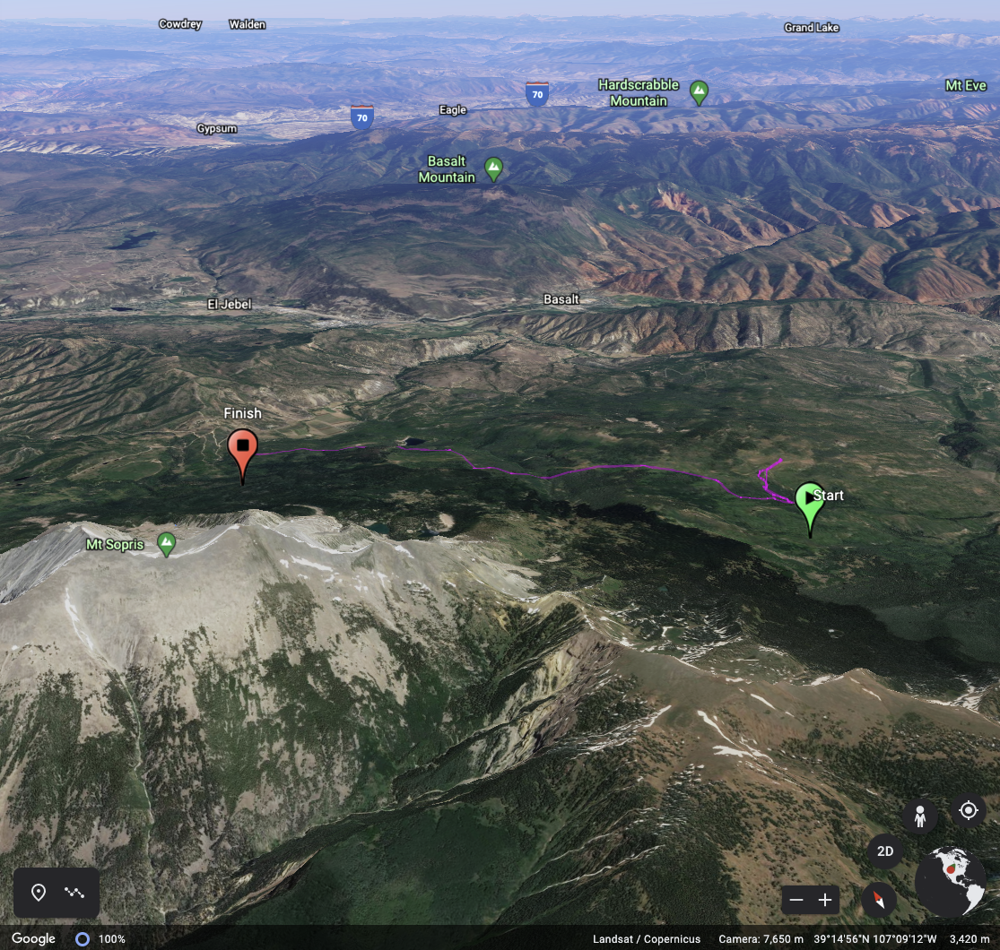

# Kameleon
Generate a [Google Earth](https://www.google.com/earth/) compatible [KML file](https://developers.google.com/kml/documentation/kml_tut) from a CSV file

### Run the default generator
The `default.js` generator uses the following CSV format (as generated by the [TrackDown Android App](https://github.com/Mierenga/track-down-android)):
```
Timestamp (UTC), Latitude, Longitude, Display Radius (Meters), Source, Device Tag, Platform, WiFi Results
2019-06-27T13:51:31.000Z,39.2632465,-107.0982669,3.0,fused,02:00:00:00:00:00,android/Google/Pixel 2,
```

To run:
```
npm install
node default.js -f sample/maroon-bells.csv -o maroon-bells.kml
```



